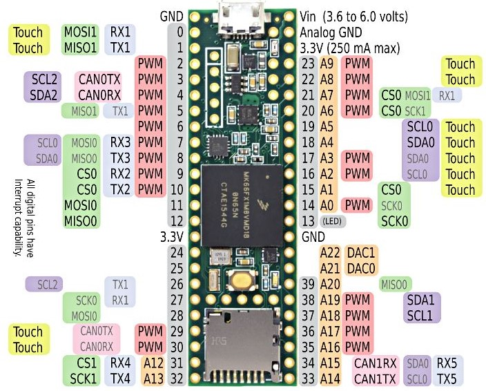
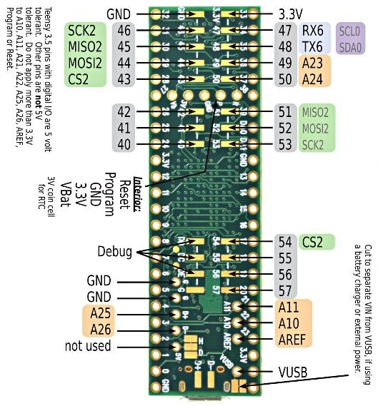
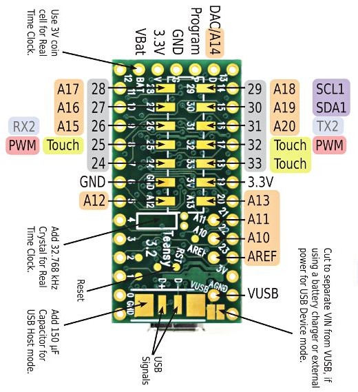

# Resources for Teensy

- Download compatible Arduino IDE [here](https://www.arduino.cc/en/Main/Software)
- Download Teensyduino for compatible Arduino IDE [here](https://www.pjrc.com/teensy/teensyduino.html)
- Slides for Teensy 3.x [here](https://www.slideshare.net/yoonghm/teensy-up-and-running-20)

# Tips and Examples for Teensy 3.x

---
## Datasheets and User Manuals

**Teensy 3.6** [Datasheet](https://www.pjrc.com/teensy/K66P144M180SF5V2.pdf). [User Manual](https://www.pjrc.com/teensy/K66P144M180SF5RMV2.pdf)

MK66FX1M0VMD18:
- NXP Kinetis K66 180 Mhz Cortex-M4F MCU
- 1.2 MB Total Flash, 1 MB Program Flash, 256 kB SRAM
- 2 x USB, Ethernet
- 144-MAPBGA

**Teensy 3.5** [Datasheet](https://www.pjrc.com/teensy/K64P144M120SF5.pdf). [User Manual](https://www.pjrc.com/teensy/K64P144M120SF5RM.pdf)

MK64FX512VMD12:
- NXP Kinetis K64 120 Mhz Cortex-M4F MCU
- 512 kB Flash, 128 kB FlexMem, 256 kB SRAM
- 1 x USB, Ethernet
- 144-MAPBGA

**Teensy 3.1/3.2** [Datasheet](https://www.pjrc.com/teensy/K20P64M72SF1.pdf). [User Manual](https://www.pjrc.com/teensy/K20P64M72SF1RM.pdf)

MK20DX256VLH7:
- NXP Kinetis K20 72 Mhz Cortex-M4F MCU
- 256 kB Flash, 64 kB SRAM, USB
- 64-LQFP

---
## Pinouts

|**Teensy 3.6**                                           |**Teensy 3.5**                                          |
|:-------------------------------------------------------:|:------------------------------------------------------:|
|      |     |

|**Teensy 3.2**                                           |**Teensy 3.1**                                          |
|:-------------------------------------------------------:|:------------------------------------------------------:|
|      |     |

|**Teensy 3.6 Back**                                      |**Teensy 3.5 Back**                                     |
|:-------------------------------------------------------:|:------------------------------------------------------:|
| ||

|**Teensy 3.2 Back**                                      |**Teensy 3.1 Back**                                     |
|:-------------------------------------------------------:|:------------------------------------------------------:|
| ||

---

## Schematics

|**Teensy 3.5 & 3.6**                   |
|:-------------------------------------:|
||

|**Teensy 3.2**                         |
|:-------------------------------------:|
||

|**Teensy 3.0, 3.1**                    |
|:-------------------------------------:|
| |

---

## Command-Line Tools

1. [Teensy Loader](https://github.com/PaulStoffregen/teensy_loader_cli)
2. [TyTools](http://neodd.com/tytools/)

